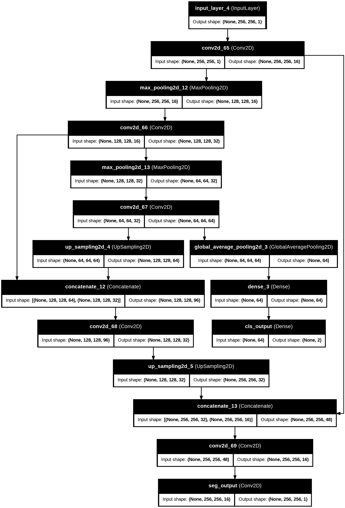

# Breast Ultrasound Image Segmentation & Classification

This project implements a **Multi-task U-Net** to jointly perform **lesion segmentation** and **tumor classification** (normal, benign, malignant) using the **Breast Ultrasound Image Dataset**.  
The model aims to assist in early detection and analysis of potential breast cancer cases by combining segmentation and classification in a single deep learning framework.

---

## Dataset
- **Name:** Breast Ultrasound Image Dataset  
- **Contents:** Ultrasound scans with corresponding lesion masks and image-level labels  
- **Preprocessing:**
  - Resized to 256×256 pixels  
  - Normalized pixel values  
  - Noise reduction applied  
  - Verified lesion masks and labels  

---

## Model Architecture
- **Encoder:** Shared contracting path (like U-Net) to extract feature maps  
- **Segmentation Head:** U-Net style decoder with skip connections → outputs pixel-wise lesion masks  
- **Classification Head:** Global Average Pooling at bottleneck → Fully Connected Layers → class prediction (normal / benign / malignant)  

<p align="center">
  
</p>


---

## Training Strategy
- **Loss Functions:**
  - Segmentation → Dice Loss + Cross-Entropy  
  - Classification → Cross-Entropy  
  - Combined Loss: `α·SegmentationLoss + β·ClassificationLoss`  
- **Optimization:** Adam optimizer, learning rate scheduling, early stopping  

---

## Evaluation Metrics
- **Segmentation:**  
  - Dice Coefficient  
  - Mean Intersection over Union (mIoU)  
  - Pixel Accuracy  

- **Classification:**  
  - Accuracy  
  - Precision, Recall, F1-score  

---

## How to Run
```bash
# Clone repository
git clone https://github.com/yourusername/breast-ultrasound-unet.git
cd breast-ultrasound-unet

# Install dependencies
pip install -r requirements.txt

# Train the model
python train.py --dataset ./dataset --epochs 50 --batch_size 16

# Evaluate the model
python evaluate.py --dataset ./dataset
